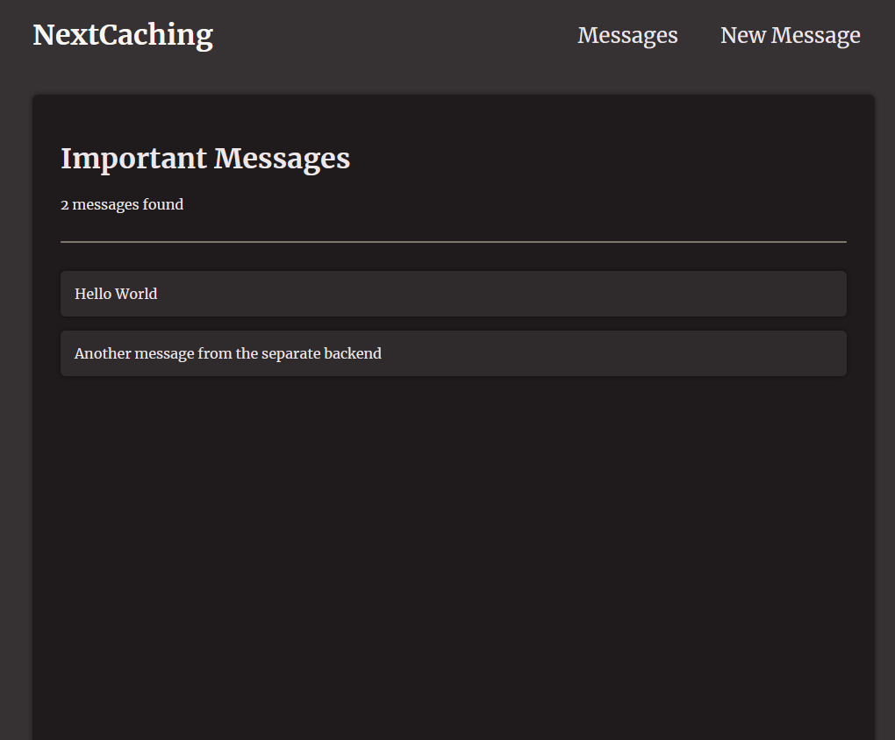
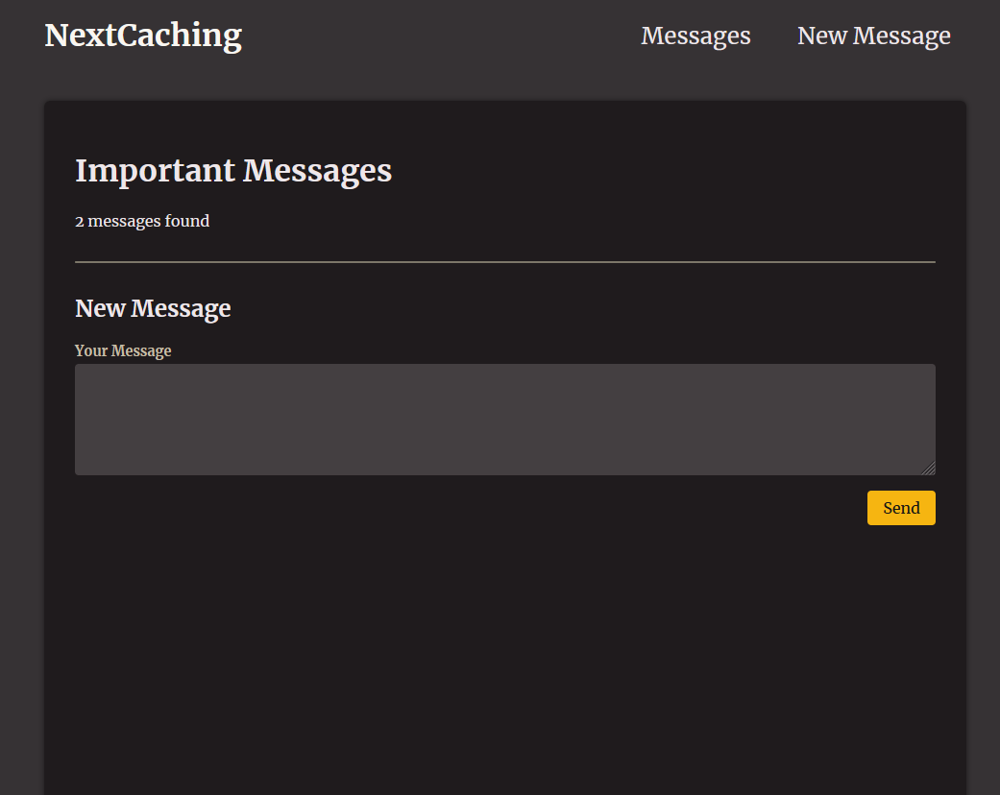

# Start App #
npm install
npm run dev

cd backend
npm install
npm start

## Caching ##
1. Request memoization: 
- Stores data requests with the same configuration, which avoids duplicate data fetch.
- Cache only persist during request duration
2. Data Cache
- Stores and reuses fetched data until is revalidated, which avoids unnecessary requests to the data source and speeds up
- Cache persists until is revalidated
3. Full route cache
- Stores the rendered HTML at build time which avoids unnecessarY html render cycles and data fetches
- Cache persists unditl related data cache is revalidated
4. Router cache
- Stores the RSC payload in memory in the browser which ensures fast page transition since no server req is needed.

`revalidatePath('/messages');
revalidateTag('msg);
export const revalidate = 5;
export const dynamic = 'force-dynamic';
unstable_noStore(); //disable cache for a specific component`

# Message App #

